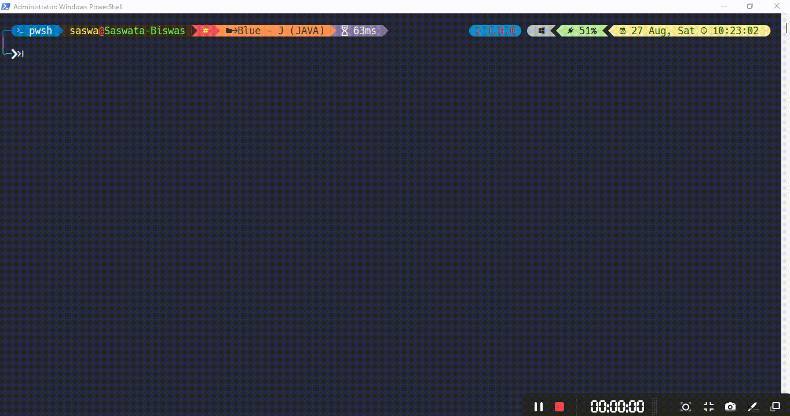

# Java-Calculator

A Terminal based Calculator built with Java

## Features

- Capability to evaluate arithmetic expressions.
- Uses the concept of **Polish Strings** for evaluation.
- Generates appropriate _postfix_ expressions.

## Requirement

- Java installed and set in `PATH`.

## Usage

### From Source

1. Compile the `Calculator.java` file

   ```console
   foo@bar:~$ javac Calculator.java
   ```

1. Run the Calculator

   ```console
   foo@bar:~$ java Calculator
   ```

<h3 align=center>Preview</h3>

[](https://github.com/aycetiner/Java-Calculator#JAB)

### Via JAR

- Requires Java (>=8)

  ```console
  foo@bar:~$ java -jar Calculator.jar
  ```

## Commands

|         Syntax          |            Meaning             |
| :---------------------: | :----------------------------: |
|           `e`           |         Euler's Number         |
|          `pi`           |      <code>&#960;</code>       |
|          `n!`           |        Factorial of `n`        |
|        `1.6E-19`        |     $1.6 \times 10^{-19}$      |
|         n `C` r         |     $\frac{n!}{(n-r)!~r!}$     |
|         n `P` r         |      $\frac{n!}{(n-r)!}$       |
|         a `%` b         |     Modulus or, Remainder      |
|         a `^` b         |         a<sup>b</sup>          |
| b <code>&#124;</code> a |         $\sqrt[b]{a}$          |
|          `ans`          |        Previous Result         |
|         `log()`         |        log<sub>10</sub>        |
|         `ln()`          |        log<sub>e</sub>         |
|         `rad()`         |       &deg; to _radian_        |
|         `deg()`         |       _radian_ to &deg;        |
|         `sin()`         |      sin (&ang; in &deg;)      |
|         `cos()`         |      cos (&ang; in &deg;)      |
|         `tan()`         |      tan (&ang; in &deg;)      |
|        `sinr()`         |    sin (&ang; in _radian_)     |
|        `cosr()`         |    cos (&ang; in _radian_)     |
|        `tanr()`         |    tan (&ang; in _radian_)     |
|        `sini()`         |  sin<sup>-1</sup> (in &deg;)   |
|        `cosi()`         |  cos<sup>-1</sup> (in &deg;)   |
|        `tani()`         |  tan<sup>-1</sup> (in &deg;)   |
|        `sinir()`        | sin<sup>-1</sup> (in _radian_) |
|        `cosir()`        | cos<sup>-1</sup> (in _radian_) |
|        `tanir()`        | tan<sup>-1</sup> (in _radian_) |
|        `sinh()`         |       sin [*hyperbolic*]       |
|        `cosh()`         |       cos [*hyperbolic*]       |
|        `tanh()`         |       tan [*hyperbolic*]       |
